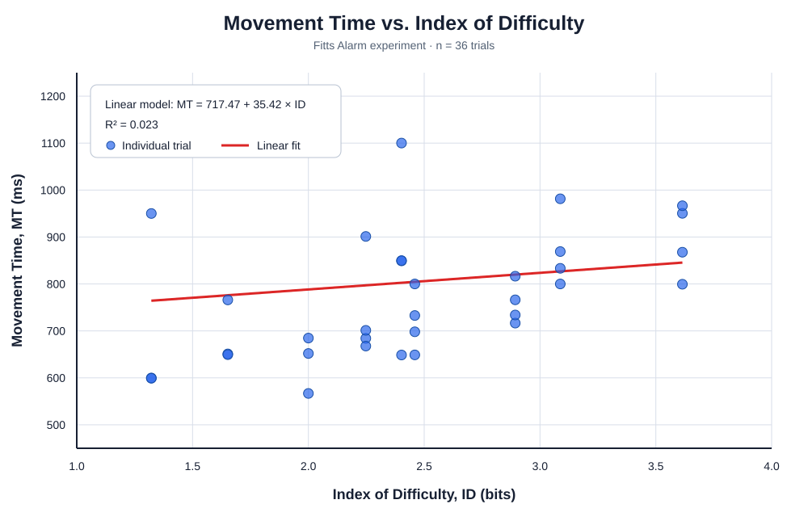

# Fitts Alarm: AI-Assisted Fitts' Law Experiment

- **Live experiment:** [https://thisisroni.github.io/Fitts_Alarm/](https://thisisroni.github.io/Fitts_Alarm/)
- **Experiment video:** [https://youtu.be/GWm5lXoYIuI](https://youtu.be/GWm5lXoYIuI)
- **Source code:** [GitHub repository](https://github.com/thisisroni/Fitts_Alarm)

## 1. Scenario and User Context

The target user is a university student living in a dormitory who needs to wake up independently for an early class. Because nobody else is available to wake the student, the alarm must do more than produce a sound: it must help ensure that the user becomes alert enough to get out of bed.

Conventional alarm interfaces are easy to dismiss with a single tap or swipe. After repeated use, dismissing an alarm can become an automatic response that requires little attention. A sleepy user may therefore silence several alarms through muscle memory and immediately fall asleep again. This project explores whether replacing the single dismiss button with a short visual-motor task can interrupt that automatic behavior and require deliberate attention.

## 2. Design Motivation and Innovation

Rather than making the alarm louder or adding more alarms, this design increases the attention required to dismiss it. Its main innovation is applying Fitts' Law to an anti-snooze interaction: 36 targets change in both position and size, requiring repeated visual search and deliberate pointing instead of one memorized gesture.

The prototype therefore combines a behavioral intervention with an experimental tool. It records movement time and missed clicks, and it supports session labels for future comparisons between conditions such as `sleepy` and `awake`.

## 3. Application

Fitts Alarm is a single-file HTML/JavaScript application that runs in a desktop browser. Its interactive 900 × 700 canvas presents the alarm interface and the clicking task. After the user clicks the start button, the application displays one target at a time until all 36 trials are complete.

The experiment systematically varies two independent variables:

| Variable | Levels |
|---|---|
| Target distance, A | 150, 300, and 450 px |
| Target width, W | 40, 70, and 100 px |
| Repetitions | 4 per `(A, W)` combination |
| Total trials | 3 × 3 × 4 = 36 |

The nine `(A, W)` combinations are randomized using a Fisher-Yates shuffle. Movement time (MT) is recorded with `performance.now()`. For the first trial, timing begins when the user clicks the start button. For later trials, timing begins after the previous target is successfully selected. Clicking outside the target increases the trial's `misses` value without resetting the timer. At the end, the application exports `trial`, `A`, `W`, `MT`, `misses`, and `session` as a CSV file.

## 4. AI-Assisted Prototyping

The initial anti-snooze idea was discussed with Claude, which helped transform it into a structured application and experiment specification. This specification was then given to Codex for implementation as a single-file web application. After the experiment was deployed and the participant data were collected, the CSV results were reviewed with Codex to calculate the Index of Difficulty, perform the linear regression, generate the scatter plot, and organize this report.

## 5. Method

### Participant

One university student, who was also the developer of the application, completed one session of the experiment. The dataset contains 36 trials.

### Apparatus

The session was conducted in a web browser on a laptop. The exact laptop model, display specifications, browser version, and pointing device were not recorded.

### Procedure

The participant opened the deployed experiment, started the alarm-dismissal task, and clicked each target as quickly and accurately as possible. Target conditions were presented in randomized order. After completing all 36 trials, the participant downloaded the resulting CSV file. The interaction was also recorded on video.

## 6. Data Analysis

The Shannon formulation of the Index of Difficulty was used:

$$
ID = \log_2\left(\frac{A}{W}+1\right)
$$

Here, `A` is the target distance in pixels, `W` is the target diameter in pixels, and ID is measured in bits. For example, when `A = 150 px` and `W = 100 px`:

$$
ID = \log_2\left(\frac{150}{100}+1\right)
   = \log_2(2.5)
   = 1.322\text{ bits}
$$

The nine experimental conditions produced the following ID values:

| A (px) | W (px) | ID (bits) |
|---:|---:|---:|
| 150 | 100 | 1.3219 |
| 150 | 70 | 1.6521 |
| 300 | 100 | 2.0000 |
| 150 | 40 | 2.2479 |
| 300 | 70 | 2.4021 |
| 450 | 100 | 2.4594 |
| 450 | 70 | 2.8931 |
| 300 | 40 | 3.0875 |
| 450 | 40 | 3.6147 |

A least-squares linear regression was then fitted using the standard Fitts' Law model:

$$
MT = a + b(ID)
$$

## 7. Results

The participant completed all 36 trials, with a mean movement time of **802.80 ms**. Three trials contained one missed click, giving a total of three misses.

The regression produced:

- Intercept, $a = 717.47$ ms
- Slope, $b = 35.42$ ms/bit
- Coefficient of determination, $R^2 = 0.023$

The fitted slope was positive, which is directionally consistent with Fitts' Law: movement time tended to increase as index of difficulty increased. However, the very low $R^2$ indicates that ID explained only approximately **2.3%** of the observed variation in MT in this session. Therefore, this small dataset does not provide strong evidence of a reliable linear relationship.

## 8. Custom Fitts' Law Equation

Using the empirically derived values of $a$ and $b$, the custom equation is:

$$
\boxed{MT = 717.47 + 35.42\log_2\left(\frac{A}{W}+1\right)}
$$

where MT is measured in milliseconds, A and W are measured in pixels, and the fitted slope is measured in milliseconds per bit.

## 9. Discussion

The positive slope follows the expected direction of Fitts' Law, but the low $R^2$ shows that ID explained little of the variation in MT. The result should be treated as preliminary because it is based on one participant and one session, includes retry time from three missed clicks, and may also reflect learning and changes in attention.

Because no controlled `sleepy` versus `awake` comparison was conducted, the data cannot yet show that the task prevents oversleeping. Future work should repeat both conditions across multiple days and participants, record alertness and error rate, and test a mobile version that better matches the real context of using a phone as an alarm.

## 10. Conclusion

Fitts Alarm successfully turns an anti-snooze concept into a measurable Fitts' Law experiment. The first session showed a weak positive relationship between difficulty and movement time, but controlled mobile testing is still needed to determine whether the interaction improves wakefulness in practice.
